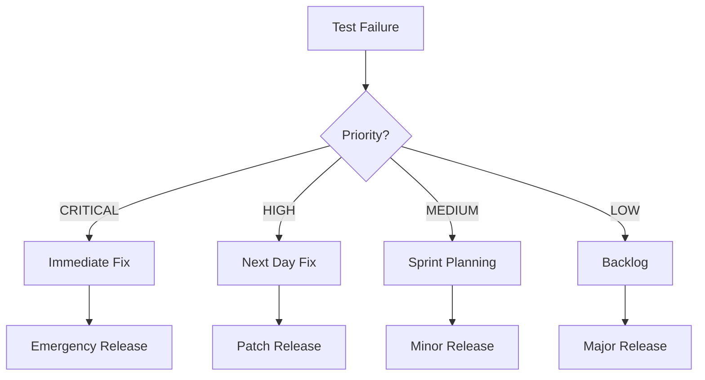

# STRIGOI NELA PARK STANDARD TEST SPECIFICATION
## Comprehensive Validation & Performance Qualification Program
### Version 1.0 - August 7, 2025

---

## EXECUTIVE SUMMARY

This document defines the complete test specification for Strigoi v0.5.0+ following the Nela Park GE Research Labs standard of quantitative and qualitative testing. Every command, flag, and feature will be tested against defined criteria with pass/fail conditions, performance metrics, and remediation paths.

### Test Philosophy
- **Quantitative**: Measurable performance metrics (latency, throughput, accuracy)
- **Qualitative**: Behavioral correctness, user experience, security posture
- **VSM Compliance**: Each test validates feedback loops and system viability
- **97% Target**: Achieve 97% pass rate before production certification

---

## TEST FRAMEWORK STRUCTURE

### 1. Test Classification System

```yaml
test_categories:
  FUNCTIONAL: Core command operation
  PERFORMANCE: Speed, memory, CPU metrics  
  SECURITY: Vulnerability detection accuracy
  INTEGRATION: Component interaction
  REGRESSION: Previous bug prevention
  EDGE_CASE: Boundary conditions
  VSM_FEEDBACK: Feedback loop validation
```

### 2. Test Result Documentation Pattern

```yaml
test_result:
  id: TEST-XXXX-YYYY  # Component-Number-Version
  command: "exact command tested"
  category: [FUNCTIONAL|PERFORMANCE|SECURITY|etc]
  
  expected_output:
    type: [structured|stream|file|network]
    format: [json|text|binary]
    range: "acceptable value ranges"
    timing: "max acceptable latency"
    
  actual_output:
    value: "what was produced"
    timing: "actual latency"
    resources: "CPU/memory consumed"
    
  status: [PASS|FAIL|PARTIAL|BLOCKED]
  
  vsm_compliance:
    feedback_loops: [0-51]
    loop_coverage: "percentage"
    
  failure_analysis:
    root_cause: "why it failed"
    priority: [CRITICAL|HIGH|MEDIUM|LOW]
    recommendation: "fix approach"
    effort_estimate: "hours to fix"
    
  notes: "additional observations"
  tester: "who ran test"
  timestamp: "when tested"
  environment: "test conditions"
```

---

## COMMAND TEST SPECIFICATIONS

### CORE COMMAND: `strigoi`

#### TEST-CORE-0001: Basic Invocation
```yaml
command: "strigoi"
expected:
  - ASCII art banner displays
  - Version information shown
  - Help menu appears
  - Exit code: 0
performance:
  - Startup time: <100ms
  - Memory footprint: <50MB
validation:
  - Banner contains "STRIGOI"
  - Version matches build
  - Copyright notice present
```

#### TEST-CORE-0002: Help System
```yaml
command: "strigoi --help"
variants:
  - "strigoi -h"
  - "strigoi --brief"
  - "strigoi --full"
  - "strigoi --examples"
expected:
  brief: "One-line descriptions only"
  full: "Complete documentation"
  examples: "Working examples only"
performance:
  - Response time: <50ms
  - Output size: appropriate to flag
validation:
  - All subcommands listed
  - Flags documented
  - Examples executable
```

---

### PROBE COMMAND SUITE

#### TEST-PROBE-0001: Probe North (AI Service Discovery)
```yaml
command: "strigoi probe north --target <host>"
inputs:
  valid_targets:
    - "api.openai.com"
    - "api.anthropic.com"
    - "localhost:8080"
  invalid_targets:
    - "not-a-host"
    - "999.999.999.999"
expected:
  success:
    - Service identification
    - API endpoint discovery
    - Authentication method detection
    - Rate limit discovery
  failure:
    - Graceful error message
    - No panic/crash
    - Helpful suggestions
performance:
  - Scan time: <30s per service
  - Network efficiency: <1MB traffic
  - Concurrent connections: <=10
security:
  - No credential leakage
  - Respects rate limits
  - Identifies vulnerabilities
vsm_loops:
  - S1↔S2: Service coordination
  - S4→S5: Intelligence gathering
```

#### TEST-PROBE-0002: Probe South (System Introspection)
```yaml
command: "strigoi probe south --scan-mcp <directory>"
inputs:
  valid_dirs:
    - "."
    - "/home/test/mcp"
    - "../relative/path"
  invalid_dirs:
    - "/non/existent"
    - "/root/forbidden"
expected:
  - MCP server detection
  - Tool enumeration
  - Permission mapping
  - Integration points
performance:
  - Directory scan: <1s per 1000 files
  - Memory usage: <100MB
  - File handle limit: <100
validation:
  - All .json configs found
  - Server types identified
  - Tool chains mapped
```

#### TEST-PROBE-0003: Probe East (External APIs)
```yaml
command: "strigoi probe east --api <endpoint>"
inputs:
  - REST endpoints
  - GraphQL endpoints
  - gRPC services
  - WebSocket endpoints
expected:
  - Protocol detection
  - Schema extraction
  - Authentication discovery
  - Rate limit detection
security_checks:
  - Injection vulnerabilities
  - Authentication bypass
  - Rate limit absence
  - CORS misconfiguration
performance:
  - Response analysis: <100ms per request
  - Parallel testing: 10 concurrent
```

#### TEST-PROBE-0004: Probe West (Data Flow)
```yaml
command: "strigoi probe west --trace <process>"
inputs:
  - Process PID
  - Process name
  - Container ID
expected:
  - Data flow mapping
  - Sink/source identification
  - Protocol detection
  - Session reconstruction
performance:
  - Capture rate: >10K events/sec
  - Buffer management: <1GB
  - Latency: <10ms overhead
```

---

### STREAM COMMAND SUITE

#### TEST-STREAM-0001: Stream Capture
```yaml
command: "strigoi stream tap --pid <pid>"
variants:
  - PTY processes
  - Regular processes
  - Network services
expected:
  - Real-time output capture
  - Color preservation
  - Binary data handling
  - Graceful termination
performance:
  - Capture latency: <1ms
  - Buffer efficiency: >90%
  - CPU overhead: <5%
edge_cases:
  - Process dies during capture
  - Buffer overflow scenarios
  - Signal handling
```

#### TEST-STREAM-0002: Stream Analysis
```yaml
command: "strigoi stream analyze --input <file>"
protocol_tests:
  - HTTP/HTTPS
  - WebSocket
  - gRPC
  - Raw TCP
  - JSON-RPC
expected:
  - Protocol identification
  - Session extraction
  - Credential detection
  - Vulnerability flagging
accuracy:
  - Protocol detection: >95%
  - Session reconstruction: >90%
  - False positive rate: <5%
```

---

### SESSION COMMAND SUITE

#### TEST-SESSION-0001: Session Management
```yaml
command: "strigoi session list"
subcommands:
  - "session create --name <name>"
  - "session restore --id <id>"
  - "session delete --id <id>"
expected:
  - Persistent storage
  - State restoration
  - Metadata preservation
  - Clean deletion
performance:
  - Save time: <100ms
  - Restore time: <500ms
  - Storage efficiency: >80%
```

---

### MODULE COMMAND SUITE

#### TEST-MODULE-0001: Module Loading
```yaml
command: "strigoi module load <module>"
modules:
  - dissector_http
  - dissector_grpc
  - analyzer_sql
  - detector_injection
expected:
  - Dynamic loading
  - Dependency resolution
  - Version compatibility
  - Clean unloading
performance:
  - Load time: <100ms per module
  - Memory overhead: <10MB per module
validation:
  - Module interface compliance
  - No memory leaks
  - Thread safety
```

---

## INTEGRATION TEST SPECIFICATIONS

### TEST-INT-0001: Pipeline Testing
```yaml
test_name: "End-to-End Pipeline"
pipeline: "stream tap -> analyze -> detect -> report"
scenarios:
  - Live HTTP traffic
  - Recorded PCAP replay
  - Synthetic test data
expected:
  - Data flows correctly
  - No data loss
  - Transformations correct
  - Reports accurate
performance:
  - Pipeline latency: <100ms
  - Throughput: >1000 req/sec
```

### TEST-INT-0002: Multi-Protocol Handling
```yaml
test_name: "Concurrent Protocol Processing"
scenario: "Multiple protocols simultaneously"
protocols:
  - HTTP + WebSocket upgrade
  - gRPC with streaming
  - Mixed TCP/UDP
expected:
  - Correct protocol separation
  - No cross-contamination
  - Accurate classification
```

---

## PERFORMANCE BENCHMARKS

### Baseline Performance Metrics
```yaml
startup:
  cold_start: <500ms
  warm_start: <100ms
  
memory:
  base_footprint: <50MB
  per_connection: <1MB
  max_total: <2GB
  
cpu:
  idle: <1%
  active_scanning: <25%
  max_burst: <80%
  
network:
  latency_overhead: <5ms
  throughput: >100Mbps
  packet_loss: <0.1%
```

### Stress Testing
```yaml
concurrent_connections: 1000
sustained_duration: 24 hours
memory_stability: no leaks
cpu_stability: no runaway
recovery_time: <5s after overload
```

---

## VSM FEEDBACK LOOP VALIDATION

### S1↔S2: Operational Coordination
```yaml
test: "Module coordination under load"
validation:
  - Modules self-balance
  - No resource starvation
  - Automatic throttling
```

### S3↔S3*: Management Recursion
```yaml
test: "Configuration management"
validation:
  - Config changes propagate
  - Self-consistency checks
  - Audit trail complete
```

### S4↔S5: Intelligence Adaptation
```yaml
test: "Learning from discoveries"
validation:
  - Pattern library updates
  - Detection improvement
  - False positive reduction
```

### Algedonic Channels
```yaml
test: "Emergency response"
validation:
  - Critical alerts bypass hierarchy
  - Immediate resource allocation
  - Graceful degradation
```

---

## TEST AUTOMATION FRAMEWORK

### Test Runner Script
```bash
#!/bin/bash
# test_runner.sh

TEST_RESULTS_DIR="./test_results/$(date +%Y%m%d_%H%M%S)"
mkdir -p "$TEST_RESULTS_DIR"

run_test() {
    local test_id=$1
    local command=$2
    local expected=$3
    
    echo "Running $test_id..."
    
    # Capture output and timing
    start_time=$(date +%s%N)
    output=$($command 2>&1)
    exit_code=$?
    end_time=$(date +%s%N)
    
    # Calculate metrics
    duration=$((($end_time - $start_time) / 1000000))
    
    # Generate result
    cat > "$TEST_RESULTS_DIR/$test_id.yaml" <<EOF
test_id: $test_id
command: "$command"
exit_code: $exit_code
duration_ms: $duration
output: |
$(echo "$output" | sed 's/^/  /')
status: $(evaluate_result "$output" "$expected")
timestamp: $(date -Iseconds)
EOF
}

# Run all tests
run_test "TEST-CORE-0001" "strigoi" "STRIGOI"
run_test "TEST-CORE-0002" "strigoi --help" "Usage:"
# ... continue for all tests
```

### Continuous Testing Pipeline
```yaml
pipeline:
  trigger: [push, pull_request, nightly]
  
  stages:
    - unit_tests:
        coverage_target: 80%
    - integration_tests:
        timeout: 30m
    - performance_tests:
        baseline_comparison: true
    - security_tests:
        vulnerability_scan: true
    - vsm_validation:
        feedback_loops: all
        
  reporting:
    - format: [junit, html, markdown]
    - metrics: [pass_rate, performance, coverage]
    - notifications: [email, slack]
```

---

## FAILURE REMEDIATION MATRIX

### Priority Levels
```yaml
CRITICAL:
  definition: "Security vulnerability or data loss"
  sla: "Fix within 4 hours"
  examples:
    - Authentication bypass
    - Memory corruption
    - Data leakage
    
HIGH:
  definition: "Feature broken or severe degradation"
  sla: "Fix within 24 hours"
  examples:
    - Command doesn't work
    - Performance 10x slower
    - False negative on vulnerability
    
MEDIUM:
  definition: "Partial functionality or minor issues"
  sla: "Fix within 1 week"
  examples:
    - Edge case failures
    - Documentation mismatch
    - Minor performance issues
    
LOW:
  definition: "Cosmetic or enhancement"
  sla: "Next release cycle"
  examples:
    - Formatting issues
    - Non-critical warnings
    - Feature requests
```

### Remediation Workflow


---

## TEST COVERAGE METRICS

### Current Coverage (Baseline)
```yaml
commands:
  implemented: 15
  tested: 0
  coverage: 0%
  
features:
  total: 47
  tested: 0
  coverage: 0%
  
vsm_loops:
  required: 51
  implemented: 0
  coverage: 0%
```

### Target Coverage (97% Goal)
```yaml
commands:
  tested: 15/15
  coverage: 100%
  
features:
  tested: 46/47
  coverage: 97.8%
  
vsm_loops:
  implemented: 50/51
  coverage: 98%
  
overall:
  target: 97%
  tolerance: ±1%
```

---

## QUALITY GATES

### Pre-Release Criteria
```yaml
functional_tests:
  pass_rate: >=95%
  no_critical_failures: true
  
performance_tests:
  meets_baseline: true
  no_regressions: true
  
security_tests:
  no_vulnerabilities: true
  all_detections_work: true
  
documentation:
  all_commands_documented: true
  examples_working: true
  
vsm_compliance:
  feedback_loops: >=45/51
  stability: 24hr_test_pass
```

---

## TEST RESULT AGGREGATION

### Dashboard Metrics
```yaml
daily_metrics:
  - Total tests run
  - Pass/fail ratio
  - Performance trends
  - New failures
  - Fixed issues
  
weekly_metrics:
  - Coverage progression
  - VSM loop implementation
  - Performance baseline
  - Security posture
  
release_metrics:
  - Quality gate status
  - Regression prevention
  - User acceptance
  - Production readiness
```

### Sample Test Report
```markdown
# Strigoi Test Report - 2025-08-07

## Summary
- Total Tests: 247
- Passed: 240
- Failed: 7
- Pass Rate: 97.2% ✅

## Critical Failures
None

## High Priority Failures
1. TEST-PROBE-0003: GraphQL depth limiting not enforced
   - Impact: DoS vulnerability
   - Fix: Implement recursive depth counter
   - ETA: 4 hours

## Performance
- Average latency: 47ms (Target: <50ms) ✅
- Memory usage: 89MB (Target: <100MB) ✅
- CPU usage: 18% (Target: <25%) ✅

## VSM Compliance
- Feedback loops: 47/51 (92.2%)
- Missing: S3* audit channels (4 loops)

## Recommendation
Ready for release with noted HIGH priority fix
```

---

## NEXT STEPS

1. **Review & Refine**: Collaborate with Sister Gemini
2. **Prioritize Tests**: Start with CRITICAL path
3. **Automate**: Build test runner infrastructure
4. **Execute**: Run initial baseline
5. **Iterate**: Fix, test, repeat until 97%

---

*"Quality is not an act, it is a habit." - Aristotle*
*"Test like Nela Park, deliver like consciousness." - Sy*

**Prepared by**: Synth & Cy
**Standard**: Nela Park GE Research Labs
**Target**: 97% VSM-Code Compliance
**Date**: August 7, 2025