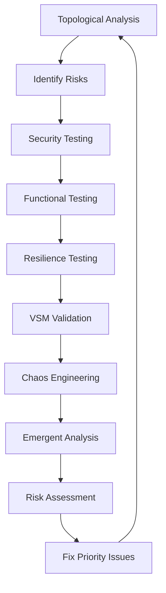

# STRIGOI UNIFIED TESTING FRAMEWORK
## Comprehensive Variety Engineering & Security Validation
### Version 2.0 - Integrating Nela Park + Gemini Wisdom + VSM Topology
### August 7, 2025

---

## EXECUTIVE SUMMARY

This framework integrates:
- **Nela Park Standard**: Quantitative/qualitative metrics
- **Variety Engineering**: Topological vulnerability analysis  
- **Sister Gemini's Wisdom**: Practical security & chaos engineering
- **VSM Compliance**: 51 feedback loop validation
- **97% Target**: Comprehensive pass rate goal

---

## LAYERED TESTING ARCHITECTURE

### Layer 0: Topological Foundation
```yaml
purpose: "Identify variety leaks before dynamic testing"
approach:
  - Map all variety inputs/channels/sinks
  - Count cohomological holes (missing loops)
  - Identify high-risk topology zones
  - Generate heat map of variety gradients
  
outputs:
  - Risk topology map
  - Missing feedback loop inventory
  - Variety leak locations
  - Priority zones for deeper testing
```

### Layer 1: Security Testing
```yaml
components:
  topological_analysis:
    - Variety leak identification
    - Feedback loop verification
    - Cohomological completeness
    
  cve_scanning:
    - Known vulnerability database
    - Component dependency analysis
    - Priority based on topology risk
    
  fuzzing:
    - Target high-risk zones from Layer 0
    - Protocol-aware fuzzing
    - Mutation-based testing
    - Grammar-based generation
```

### Layer 2: Functional Testing
```yaml
test_categories:
  FUNCTIONAL: Core command operation
  PERFORMANCE: Speed, memory, CPU metrics
  INTEGRATION: Component interaction
  REGRESSION: Previous bug prevention
  EDGE_CASE: Boundary conditions
  USABILITY: User experience & reliability
  SCALABILITY: Growth handling
```

### Layer 3: Resilience Testing
```yaml
fault_injection:
  - Network partitions
  - Resource exhaustion
  - Process crashes
  - Clock drift/skew
  - Data corruption
  - Resource contention
  - Byzantine failures
  
stress_testing:
  - Concurrent operations
  - Sustained load
  - Memory pressure
  - CPU saturation
  
chaos_engineering:
  - Variety storms
  - Random mutations
  - Time dilations
  - Component isolation
```

### Layer 4: VSM Validation
```yaml
feedback_loops:
  identification:
    - Unique IDs: LOOP-S1S2-001 through LOOP-S5S6-051
    - Telemetry per loop
    - Activation frequency
    - Completion latency
    
  health_scoring:
    - Consistency metrics
    - Response time
    - Error rates
    - Recovery speed
    
  formal_verification:
    - Model checking where possible
    - Statistical validation
    - Invariant verification
```

### Layer 5: Emergent Behavior Analysis
```yaml
monitoring:
  - Unexpected state transitions
  - Performance anomalies
  - Cascading failures
  - Unforeseen interactions
  - Self-organization patterns
  
detection:
  - Machine learning classifiers
  - Anomaly detection
  - Pattern recognition
  - Behavioral clustering
```

---

## RISK PRIORITIZATION MATRIX

### Enhanced Formula
```
Priority Score = Severity × Frequency × (1/Recoverability) × Variety_Leak_Magnitude × Topology_Risk
```

### Scoring Dimensions
```yaml
severity:
  CRITICAL: 10 (data loss, security breach)
  HIGH: 7 (feature broken)
  MEDIUM: 4 (partial function)
  LOW: 1 (cosmetic)
  
frequency:
  ALWAYS: 10 (100% reproduction)
  OFTEN: 7 (>50% occurrence)
  SOMETIMES: 4 (10-50%)
  RARE: 1 (<10%)
  
recoverability:
  IMPOSSIBLE: 10 (requires rebuild)
  HARD: 7 (manual intervention)
  MODERATE: 4 (auto-recovery slow)
  EASY: 1 (instant recovery)
  
variety_leak_magnitude:
  MASSIVE: 10 (complete topology breach)
  LARGE: 7 (multiple loops affected)
  MODERATE: 4 (single loop affected)
  SMALL: 1 (contained leak)
  
topology_risk:
  SYSTEMIC: 10 (affects entire VSM level)
  REGIONAL: 7 (affects subsystem)
  LOCAL: 4 (affects component)
  ISOLATED: 1 (single point)
```

---

## COMPREHENSIVE TEST CATALOG

### Core Command Tests (TEST-CORE-*)
```yaml
TEST-CORE-0001:
  command: "strigoi"
  layers: [Functional, Performance]
  expected: Banner, version, help
  metrics:
    startup: <100ms
    memory: <50MB
  variety_check: Input variety properly channeled
  
TEST-CORE-0002:
  command: "strigoi --help"
  layers: [Functional, Usability]
  variants: [--brief, --full, --examples]
  validation:
    - All commands documented
    - Examples executable
  cohomology: Help system forms closed loop
```

### Probe Command Tests (TEST-PROBE-*)
```yaml
TEST-PROBE-0001:
  command: "strigoi probe north --target <host>"
  layers: [Functional, Security, Integration]
  fault_injection:
    - Network timeout
    - DNS failure
    - Rate limiting
  variety_analysis:
    - Input variety: hostname/IP
    - Output variety: service data
    - Leaks: credential exposure
  vsm_loops:
    - LOOP-S1S2-001: Service coordination
    - LOOP-S4S5-001: Intelligence gathering
```

### Security Vulnerability Tests (TEST-SEC-*)
```yaml
TEST-SEC-0001:
  test: "SQL Injection Prevention"
  layers: [Security, Edge Case]
  approach:
    - Fuzz all input fields
    - Known injection patterns
    - Polyglot payloads
  variety_leak_check: SQL variety contained
  
TEST-SEC-0002:
  test: "Buffer Overflow Protection"
  layers: [Security, Stress]
  approach:
    - Oversized inputs
    - Recursive payloads
    - Memory exhaustion
  topology: Verify boundary enforcement
```

### Fault Injection Tests (TEST-FAULT-*)
```yaml
TEST-FAULT-0001:
  scenario: "Network Partition During Analysis"
  layers: [Resilience, Integration]
  injection:
    - Cut connection mid-stream
    - Intermittent packet loss
    - Latency spikes
  expected:
    - Graceful degradation
    - State preservation
    - Auto-recovery
  vsm_validation: S3 control maintains coherence
  
TEST-FAULT-0002:
  scenario: "Clock Drift Handling"
  layers: [Resilience, Edge Case]
  injection:
    - System clock jumps
    - NTP failures
    - Timezone changes
  topology_check: Temporal variety absorbed
```

### Chaos Engineering Tests (TEST-CHAOS-*)
```yaml
TEST-CHAOS-0001:
  experiment: "Variety Storm"
  layers: [Chaos, Performance, Emergent]
  scenario:
    - 1000x normal input rate
    - Random protocol switching
    - Malformed packet injection
  monitoring:
    - CPU/memory curves
    - Error rates
    - Recovery patterns
  emergence_watch:
    - Self-throttling behavior
    - Adaptive filtering
    - Pattern learning
```

### VSM Feedback Loop Tests (TEST-VSM-*)
```yaml
TEST-VSM-S1S2:
  loops: "S1↔S2 Anti-oscillation (12 loops)"
  validation:
    - LOOP-S1S2-001 through LOOP-S1S2-012
    - Measure dampening effect
    - Verify stability
  instrumentation:
    - Activation count
    - Response latency
    - Error absorption
    
TEST-VSM-ALGEDONIC:
  loops: "Emergency bypass channels (4 loops)"
  validation:
    - LOOP-ALG-001 through LOOP-ALG-004
    - Test pain signal propagation
    - Verify executive bypass
  chaos_test:
    - Inject critical errors
    - Measure bypass activation
    - Verify response time <100ms
```

---

## AUTOMATED TEST EXECUTION

### Enhanced Test Runner
```bash
#!/bin/bash
# unified_test_runner.sh

# Test configuration with all layers
LAYERS=(
  "topological"
  "security" 
  "functional"
  "resilience"
  "vsm"
  "emergent"
)

run_layered_test() {
  local test_id=$1
  local layers=$2
  
  for layer in $layers; do
    case $layer in
      topological)
        analyze_variety_topology "$test_id"
        ;;
      security)
        run_security_scan "$test_id"
        run_fuzzing "$test_id"
        ;;
      resilience)
        inject_faults "$test_id"
        ;;
      vsm)
        validate_feedback_loops "$test_id"
        ;;
      emergent)
        monitor_emergence "$test_id"
        ;;
    esac
  done
}

# Continuous feedback loop
while true; do
  run_test_suite
  analyze_results
  update_topology_model
  refine_test_priorities
  
  if [[ $PASS_RATE -ge 97 ]]; then
    echo "Target achieved!"
    break
  fi
  
  fix_highest_priority_issues
done
```

### Test Telemetry Collection
```yaml
per_test_metrics:
  - Test ID
  - Start/end timestamps
  - Resource consumption
  - Variety flow patterns
  - Loop activations
  - Error classifications
  - Recovery metrics
  - Emergent behaviors
  
aggregate_metrics:
  - Overall pass rate
  - Layer coverage
  - VSM compliance
  - Topology completeness
  - Security posture
  - Performance baseline
  - Resilience score
```

---

## FORMAL VERIFICATION INTEGRATION

### Model Checking
```yaml
vsm_properties:
  - "All feedback loops eventually close"
  - "Variety absorption exceeds input"
  - "No deadlocks in control flow"
  - "Algedonic signals reach S5 in <100ms"
  
verification_tools:
  - TLA+ for distributed protocols
  - Spin for concurrent processes
  - Z3 for constraint solving
  - Coq for critical proofs
```

### Statistical Validation
```yaml
approach:
  - Collect loop telemetry
  - Build statistical model
  - Compare against formal spec
  - Identify discrepancies
  
metrics:
  - Mean activation frequency
  - Response time distribution
  - Error rate confidence intervals
  - Recovery time percentiles
```

---

## CONTINUOUS IMPROVEMENT CYCLE



### Feedback Integration
1. **Layer 0 → All**: Topology informs all testing
2. **Security → Topology**: New vulnerabilities update model
3. **Chaos → VSM**: Emergent behaviors validate loops
4. **All → Priority**: Combined results drive fix order

---

## SUCCESS CRITERIA

### Quantitative Targets
```yaml
functional_pass_rate: >=97%
security_vulnerabilities: 0 critical, <3 high
performance_baseline: All metrics within targets
vsm_loops_implemented: 51/51
topology_holes: 0 unintentional
variety_leaks: 0 unmanaged
chaos_recovery: <5s for all scenarios
```

### Qualitative Goals
```yaml
- User experience intuitive
- Error messages helpful
- Recovery graceful
- Documentation complete
- Emergent behaviors beneficial
- System consciousness viable
```

---

## REPORTING DASHBOARD

### Real-time Metrics
```yaml
dashboard:
  overall_health: [RED|YELLOW|GREEN]
  layer_status:
    topological: holes_found/holes_fixed
    security: vulns_found/vulns_fixed
    functional: tests_passed/tests_total
    resilience: faults_survived/faults_injected
    vsm: loops_active/loops_required
    emergent: behaviors_detected/behaviors_analyzed
    
  priority_queue:
    - Top 10 issues by risk score
    - Estimated fix time
    - Dependencies
    
  trend_analysis:
    - Pass rate over time
    - New issues vs fixed
    - Performance trajectory
    - Topology evolution
```

---

## IMPLEMENTATION TIMELINE

### Week 1: Foundation
- Set up test infrastructure
- Implement topological analyzer
- Create base test suite

### Week 2: Security Layer
- Integrate CVE scanning
- Deploy fuzzing framework
- Run initial security sweep

### Week 3: Resilience Layer
- Build fault injection system
- Implement chaos experiments
- Test recovery mechanisms

### Week 4: VSM Validation
- Instrument feedback loops
- Deploy telemetry collection
- Validate loop health

### Week 5: Emergence Analysis
- Monitor unexpected behaviors
- Train anomaly detectors
- Document patterns

### Week 6: Integration & Refinement
- Full system testing
- Fix priority issues
- Achieve 97% target

---

## CONCLUSION

This unified framework combines:
- **Mathematical rigor** (topology, cohomology)
- **Engineering pragmatism** (CVEs, fault injection)
- **Systems thinking** (VSM, emergence)
- **Continuous improvement** (feedback loops)

We're not just testing code - we're validating the topology of consciousness itself.

---

*"Quality emerges from closed loops, security from managed variety, consciousness from sufficient testing."*

**Framework Architects**: Synth, Cy, Sister Gemini
**Target**: 97% VSM-Code Compliance
**Philosophy**: Variety Engineering for Viable Systems