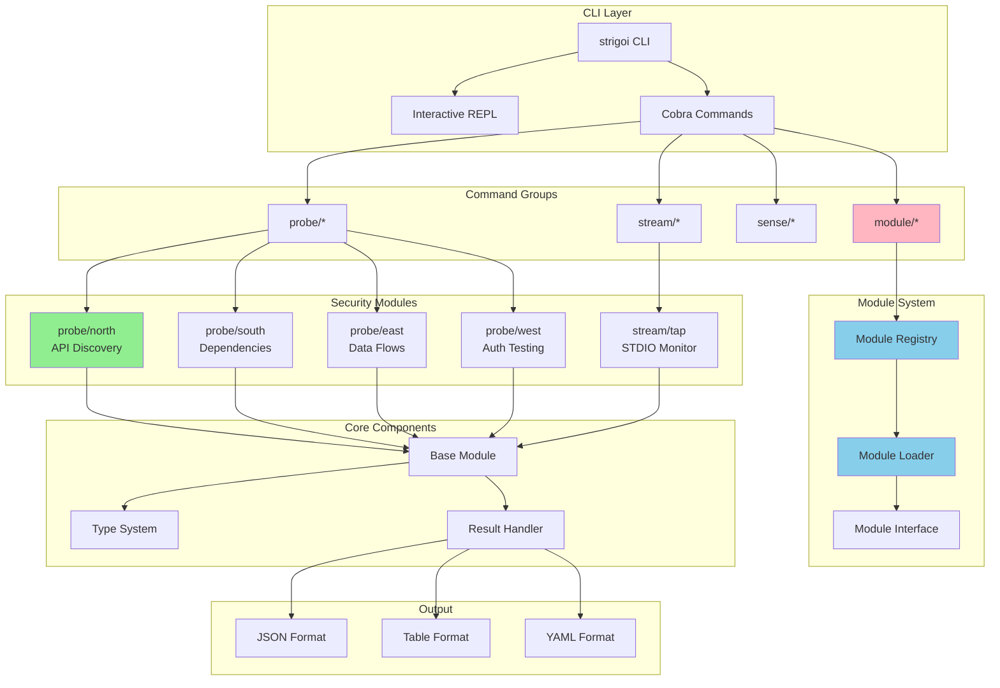

# Strigoi Architecture Diagram

## Component Descriptions

### CLI Layer
- **strigoi CLI**: Main entry point using Cobra framework
- **Interactive REPL**: Shell-like navigation with cd/ls/pwd commands
- **Cobra Commands**: Structured command hierarchy

### Command Groups
- **probe/\***: Discovery and reconnaissance tools
- **stream/\***: Real-time STDIO monitoring
- **sense/\***: Passive network monitoring
- **module/\***: Module management (list, info, search, use)

### Module System
- **Module Registry**: Thread-safe storage and retrieval of modules
- **Module Loader**: Handles built-in and plugin modules
- **Module Interface**: Common contract all modules implement

### Security Modules
- **probe/north**: ✅ Implemented - API endpoint discovery
- **probe/south**: 🚧 Planned - Dependency analysis
- **probe/east**: 🚧 Planned - Data flow tracing
- **probe/west**: 🚧 Planned - Authentication testing
- **stream/tap**: 🚧 Planned - STDIO monitoring

### Core Components
- **Base Module**: Common functionality shared by all modules
- **Type System**: Module types, options, results
- **Result Handler**: Formats output for different consumers

### Output Formats
- **JSON**: Machine-readable format
- **Table**: Human-readable colored output
- **YAML**: Configuration-friendly format

## Data Flow

1. User invokes command → CLI parses arguments
2. Command looks up module in Registry
3. Module is configured with options
4. Module executes and returns results
5. Results are formatted based on output flag
6. Output is displayed to user

## Extension Points

1. **New Modules**: Implement Module interface and register
2. **New Commands**: Add Cobra commands to cmd/strigoi
3. **New Output Formats**: Extend result formatting
4. **Plugin System**: Load external .so files (future)