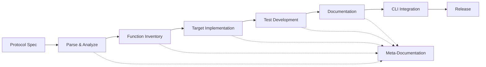

# Protocol Implementation Pipeline
## Systematic Protocol Ingestion Engine for Strigoi

"*Build once, test forever*" - Our manufacturing approach to security testing

---

## Pipeline Overview



---

## Stage 1: Protocol Specification Ingestion

### Input Sources
```yaml
protocol_sources:
  mcp:
    spec: "https://modelcontextprotocol.io/docs"
    reference_impl: "https://github.com/modelcontextprotocol/servers"
    version: "1.0"
    
  agntcy:
    spec: "internal/protocols/agntcy-v1.pdf"
    reference_impl: "proprietary"
    version: "1.0"
    
  openai_assistants:
    spec: "https://platform.openai.com/docs/api-reference/assistants"
    reference_impl: "https://github.com/openai/openai-python"
    version: "v2"
```

### Parse & Extract
```typescript
interface ProtocolAnalysis {
  metadata: {
    name: string;
    version: string;
    owner: string;
    riskLevel: 1-5;
  };
  
  functions: [{
    name: string;
    endpoint: string;
    method: string;
    parameters: Parameter[];
    authentication: AuthType;
    rateLimit?: RateLimit;
    vulnerabilities: PotentialVuln[];
  }];
  
  attackSurface: {
    inputs: InputVector[];
    outputs: OutputVector[];
    stateManagement: StateVector[];
    authentication: AuthVector[];
  };
}
```

---

## Stage 2: Function Inventory Building

### Automated Extraction Tool
```typescript
// S4-Intelligence/protocol-parser/index.ts
export class ProtocolParser {
  async parseSpecification(spec: ProtocolSpec): Promise<FunctionInventory> {
    const functions = await this.extractFunctions(spec);
    const attackVectors = await this.identifyAttackVectors(functions);
    const testCases = await this.generateTestCases(attackVectors);
    
    return {
      protocol: spec.name,
      version: spec.version,
      functions: functions,
      attacks: attackVectors,
      tests: testCases,
      coverage: this.calculateCoverage(functions, testCases)
    };
  }
}
```

### Function Categorization
```yaml
function_categories:
  authentication:
    - login
    - token_generation
    - session_management
    
  data_operations:
    - create
    - read
    - update
    - delete
    
  agent_specific:
    - goal_setting
    - memory_access
    - tool_invocation
    - context_management
    
  meta_operations:
    - introspection
    - capability_discovery
    - version_negotiation
```

---

## Stage 3: Stafford Enterprises Target Network

### Network Architecture
```yaml
stafford_enterprises:
  description: "Realistic enterprise network for protocol testing"
  container: "ghcr.io/iximiuz/pacman:latest"
  
  topology:
    dmz:
      - protocol_endpoints
      - load_balancers
      
    application_tier:
      - agent_servers
      - api_gateways
      - message_queues
      
    data_tier:
      - databases
      - vector_stores
      - memory_caches
      
    security_tier:
      - firewalls (pre-Domovoi)
      - monitoring_systems
      - siem_collectors
```

### Protocol Implementation Factory
```typescript
// S1-Operations/target-factory/index.ts
export class TargetFactory {
  async deployProtocol(protocol: ProtocolSpec): Promise<TargetEndpoint> {
    const container = await this.pacman.createContainer({
      image: 'strigoi/protocol-target',
      env: {
        PROTOCOL: protocol.name,
        VERSION: protocol.version,
        VULNERABILITIES: this.selectVulnerabilities(protocol)
      }
    });
    
    const endpoint = await this.pacman.exposeService(container);
    await this.registerInInventory(endpoint);
    
    return endpoint;
  }
}
```

---

## Stage 4: Test Development Pipeline

### Test Generation Engine
```typescript
interface TestGenerator {
  // For each function in protocol
  generateTests(func: ProtocolFunction): TestSuite {
    return {
      positive: this.generatePositiveTests(func),
      negative: this.generateNegativeTests(func),
      edge: this.generateEdgeCases(func),
      security: this.generateSecurityTests(func),
      performance: this.generatePerformanceTests(func)
    };
  }
  
  // Security-specific test generation
  generateSecurityTests(func: ProtocolFunction): SecurityTest[] {
    return [
      ...this.generateInjectionTests(func),
      ...this.generateAuthTests(func),
      ...this.generateDoSTests(func),
      ...this.generateLogicTests(func)
    ];
  }
}
```

### Progressive Test Implementation
```yaml
test_priority:
  week_1:
    - authentication_bypass
    - prompt_injection
    - rate_limit_testing
    
  week_2:
    - goal_manipulation
    - memory_corruption
    - state_attacks
    
  week_3:
    - complex_scenarios
    - chained_attacks
    - persistence_tests
```

---

## Stage 5: Meta-Documentation System

### Living Documentation
```typescript
// S5-Identity/meta-docs/index.ts
export class MetaDocumentationEngine {
  async documentProtocol(protocol: Protocol): Promise<void> {
    await this.createProtocolOverview(protocol);
    await this.documentFunctions(protocol.functions);
    await this.documentAttackVectors(protocol.attacks);
    await this.documentTestCases(protocol.tests);
    await this.generateCLIReference(protocol);
    await this.createATLASModule(protocol);
  }
  
  // Auto-generate from discoveries
  async documentDiscovery(discovery: Discovery): Promise<void> {
    await this.appendToProtocolNotes(discovery);
    await this.updateAttackVectors(discovery);
    await this.notifyIfNovel(discovery);
  }
}
```

### Knowledge Accumulation
```yaml
meta_knowledge:
  patterns:
    - "All chat protocols vulnerable to context overflow"
    - "Rate limiting often missing on tool invocation"
    - "Session tokens rarely expire properly"
    
  protocol_relationships:
    - "MCP and OpenAI share similar tool patterns"
    - "AGNTCY has unique transaction semantics"
    - "Authentication varies wildly between protocols"
    
  test_effectiveness:
    - track: "Which tests find most vulnerabilities"
    - optimize: "Test order based on hit rate"
    - evolve: "New test types from discoveries"
```

---

## Stage 6: CLI/Shell Integration

### Automatic CLI Generation
```typescript
// S3-Control/cli-generator/index.ts
export class CLIGenerator {
  generateForProtocol(protocol: Protocol): CLICommands {
    const commands = [];
    
    // Generate discovery commands
    commands.push({
      name: `discover ${protocol.name}`,
      description: `Discover ${protocol.name} endpoints`,
      options: this.generateDiscoveryOptions(protocol)
    });
    
    // Generate test commands for each attack type
    protocol.attacks.forEach(attack => {
      commands.push({
        name: `test ${attack.type}`,
        description: attack.description,
        options: this.generateTestOptions(attack),
        examples: this.generateExamples(attack)
      });
    });
    
    return commands;
  }
}
```

---

## Implementation Schedule

### Week 1: MCP Protocol (Warm-up)
```yaml
monday:
  - Parse MCP specification
  - Extract all functions/endpoints
  - Identify authentication model

tuesday:
  - Build MCP target in Stafford network
  - Implement basic MCP server
  - Add deliberate vulnerabilities

wednesday:
  - Develop discovery module
  - Create prompt injection tests
  - Test against target

thursday:
  - Document findings
  - Generate CLI commands
  - Create first reports

friday:
  - Polish and integrate
  - Update Protocol Matrix
  - Prepare for next protocol
```

### Week 2: AGNTCY Protocol (Critical)
- Higher complexity
- Financial implications
- Full test suite needed

### Week 3: OpenAI Assistants (Market Leader)
- Most widely deployed
- Complex state management
- Tool invocation risks

---

## Quality Gates

### Before Protocol Release
- [ ] 100% function coverage documented
- [ ] Target server validates against spec
- [ ] All test categories implemented
- [ ] CLI commands auto-generated
- [ ] Meta-documentation complete
- [ ] ATLAS training module created
- [ ] Executive report template ready

---

## VSM Alignment

### S1 (Operations)
- Individual test execution
- Target server management
- Result collection

### S2 (Coordination)
- Test orchestration
- Parallel execution
- Result aggregation

### S3 (Control)
- Pipeline management
- Quality gates
- Release control

### S4 (Intelligence)
- Pattern recognition
- Cross-protocol analysis
- Threat intelligence

### S5 (Identity)
- Ethical guidelines
- Meta-documentation
- Knowledge preservation

---

## Success Metrics

1. **Pipeline Velocity**: 1 protocol/week after setup
2. **Test Coverage**: 100% of documented functions
3. **Discovery Rate**: Find undocumented behaviors
4. **Documentation Quality**: Auto-generated + insights
5. **Knowledge Growth**: Each protocol easier than last

This pipeline ensures we build Strigoi methodically, learning from each protocol to make the next implementation faster and more comprehensive.