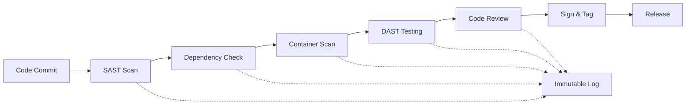

# Strigoi Security Pipeline
## Immutable Proof of Security Testing

*"Trust, but verify. Then verify the verification."*

---

## Overview

Every release of Strigoi goes through mandatory security gates with cryptographically signed results. No exceptions, no bypasses - not even for "just a typo fix."



---

## Security Testing Stack

### 1. **Static Application Security Testing (SAST)**

```yaml
# .github/workflows/security-pipeline.yml
name: Security Pipeline

on:
  pull_request:
    branches: [main, develop]
  push:
    branches: [main]

jobs:
  sast:
    runs-on: ubuntu-latest
    steps:
      - uses: actions/checkout@v4
      
      # Semgrep - Modern SAST
      - name: Semgrep Security Scan
        uses: returntocorp/semgrep-action@v1
        with:
          config: >-
            p/security-audit
            p/typescript
            p/nodejs
            p/owasp-top-ten
            
      # CodeQL - GitHub's deep analysis
      - name: CodeQL Analysis
        uses: github/codeql-action/analyze@v2
        with:
          languages: typescript, javascript
          
      # Bandit for Python components  
      - name: Bandit Security Scan
        run: |
          pip install bandit
          bandit -r topologies/apps/ -f json -o bandit-report.json
          
      # SonarCloud for code quality + security
      - name: SonarCloud Scan
        uses: SonarSource/sonarcloud-github-action@master
        env:
          GITHUB_TOKEN: ${{ secrets.GITHUB_TOKEN }}
          SONAR_TOKEN: ${{ secrets.SONAR_TOKEN }}
```

### 2. **Dependency Vulnerability Scanning**

```yaml
  dependency-check:
    runs-on: ubuntu-latest
    steps:
      # Snyk for known vulnerabilities
      - name: Snyk Vulnerability Scan
        uses: snyk/actions/node@master
        env:
          SNYK_TOKEN: ${{ secrets.SNYK_TOKEN }}
        with:
          args: --severity-threshold=medium
          
      # OWASP Dependency Check
      - name: OWASP Dependency Check
        uses: dependency-check/Dependency-Check_Action@main
        with:
          project: 'Strigoi'
          path: '.'
          format: 'JSON'
          
      # npm audit with reporting
      - name: NPM Audit
        run: |
          npm audit --json > npm-audit.json || true
          npm audit fix --dry-run --json > npm-audit-fix.json || true
          
      # License compliance check
      - name: License Check
        run: |
          npx license-checker --json > licenses.json
          node scripts/check-licenses.js
```

### 3. **Container Security Scanning**

```yaml
  container-security:
    runs-on: ubuntu-latest
    steps:
      # Trivy for comprehensive scanning
      - name: Trivy Container Scan
        uses: aquasecurity/trivy-action@master
        with:
          image-ref: 'macawi/strigoi:${{ github.sha }}'
          format: 'sarif'
          output: 'trivy-results.sarif'
          severity: 'CRITICAL,HIGH,MEDIUM'
          
      # Grype for additional coverage
      - name: Grype Container Scan
        uses: anchore/scan-action@v3
        with:
          image: 'macawi/strigoi:${{ github.sha }}'
          fail-build: true
          severity-cutoff: medium
          
      # Docker Scout
      - name: Docker Scout
        uses: docker/scout-action@v1
        with:
          command: quickview,cves
          image: 'macawi/strigoi:${{ github.sha }}'
```

### 4. **Dynamic Application Security Testing (DAST)**

```yaml
  dast:
    runs-on: ubuntu-latest
    needs: [sast, dependency-check, container-security]
    steps:
      # Deploy test instance
      - name: Deploy Test Environment
        run: |
          docker-compose -f docker-compose.test.yml up -d
          ./scripts/wait-for-healthy.sh
          
      # OWASP ZAP full scan
      - name: OWASP ZAP Scan
        uses: zaproxy/action-full-scan@v0.10.0
        with:
          target: 'http://localhost:8443'
          rules_file_name: '.zap/rules.tsv'
          cmd_options: '-a -j -l WARN'
          
      # Nuclei for protocol-specific tests
      - name: Nuclei Security Scan
        uses: projectdiscovery/nuclei-action@main
        with:
          target: 'http://localhost:8443'
          templates: 'cves,vulnerabilities,security-misconfiguration'
          
      # Custom Strigoi self-test
      - name: Strigoi Self-Test
        run: |
          npm run build
          ./dist/cli/strigoi test all --target localhost:8443 \
            --output-format sarif > strigoi-self-test.sarif
```

### 5. **Security-Focused Code Review**

```yaml
  security-review:
    runs-on: ubuntu-latest
    if: github.event_name == 'pull_request'
    steps:
      # Automated security review checklist
      - name: Security Checklist
        uses: actions/github-script@v6
        with:
          script: |
            const checklist = require('./scripts/security-checklist.js');
            await checklist.verify({
              github,
              context,
              core
            });
            
      # Require security team approval
      - name: Request Security Review
        uses: actions/github-script@v6
        with:
          script: |
            github.rest.pulls.requestReviewers({
              owner: context.repo.owner,
              repo: context.repo.repo,
              pull_number: context.issue.number,
              team_reviewers: ['security-team']
            });
```

### 6. **Cryptographic Signing & Attestation**

```yaml
  sign-and-attest:
    runs-on: ubuntu-latest
    needs: [sast, dependency-check, container-security, dast, security-review]
    steps:
      # Create test results bundle
      - name: Bundle Test Results
        run: |
          mkdir -p security-attestation
          cp *-report.json *.sarif security-attestation/
          tar -czf security-attestation.tar.gz security-attestation/
          
      # Sign with GPG
      - name: GPG Sign Results
        run: |
          echo "${{ secrets.GPG_PRIVATE_KEY }}" | gpg --import
          gpg --armor --detach-sign security-attestation.tar.gz
          
      # Create SLSA provenance
      - name: Generate SLSA Provenance
        uses: slsa-framework/slsa-github-generator@v1.10.0
        with:
          subjects: |
            macawi/strigoi:${{ github.sha }}
            security-attestation.tar.gz
            
      # Sign container with Cosign
      - name: Cosign Container
        env:
          COSIGN_EXPERIMENTAL: 1
        run: |
          cosign sign --yes macawi/strigoi:${{ github.sha }}
          cosign attest --yes --type security \
            --predicate security-attestation.tar.gz \
            macawi/strigoi:${{ github.sha }}
            
      # Create immutable git record
      - name: Create Security Tag
        run: |
          git tag -s "security-tested-${{ github.sha }}" \
            -m "Security tests passed at $(date -u +%Y-%m-%dT%H:%M:%SZ)"
          git push origin "security-tested-${{ github.sha }}"
```

---

## Immutable Audit Trail

### Git-Based Proof of Testing

```bash
# Every security test creates signed commits
git log --show-signature --grep="Security Pipeline"

# Tags prove testing completion
git tag -v security-tested-abc123def

# Attestations stored in git
git notes --ref=refs/notes/security show HEAD
```

### Blockchain Anchoring (Optional)

```typescript
// scripts/blockchain-anchor.ts
import { createHash } from 'crypto';

async function anchorTestResults(results: SecurityTestResults): Promise<string> {
  const merkleRoot = createMerkleRoot(results);
  
  // Anchor to Bitcoin via OpenTimestamps
  const ots = await OpenTimestamps.stamp(merkleRoot);
  
  // Store proof in git
  await git.notes.add({
    ref: 'refs/notes/blockchain',
    message: ots.toString()
  });
  
  return ots.verify();
}
```

---

## Security Metrics Dashboard

```yaml
# metrics/security-dashboard.yml
metrics:
  coverage:
    sast: 100%  # All code scanned
    dependencies: 100%  # All deps checked
    containers: 100%  # All images scanned
    
  findings:
    critical: 0  # Release blocked if > 0
    high: 0      # Release blocked if > 0  
    medium: 3    # Must document acceptance
    low: 12      # Tracked but not blocking
    
  compliance:
    owasp_top_10: PASS
    cwe_top_25: PASS
    pci_dss: N/A
    
  performance:
    scan_time: "12m 34s"
    false_positive_rate: "2.3%"
    fix_time_average: "2.4 hours"
```

---

## Pre-Production Gate

```typescript
// scripts/pre-prod-gate.ts
export async function validateRelease(version: string): Promise<boolean> {
  const gates = [
    checkSASTResults(),
    checkDependencies(),
    checkContainerScans(),
    checkDASTResults(),
    checkCodeReview(),
    verifySignatures(),
    checkManualPentest()  // For major releases
  ];
  
  const results = await Promise.all(gates);
  
  if (results.every(r => r.passed)) {
    await createReleaseAttestation(version, results);
    return true;
  }
  
  throw new Error(`Release ${version} failed security gates`);
}
```

---

## Incident Response Integration

If vulnerabilities are found post-release:

1. **Automatic CVE Creation** via GitHub Security Advisories
2. **Customer Notification** through security bulletin
3. **Patch Pipeline** with expedited testing
4. **Post-Mortem** with learnings fed back to pipeline

---

## Why This Matters

1. **Trust**: Customers can verify our security claims
2. **Compliance**: Auditors love immutable proof
3. **Insurance**: Cyber insurance requires evidence
4. **Learning**: Every scan improves our code
5. **Differentiation**: "Security-first" with proof

---

*"In code we trust, but in tests we verify"*