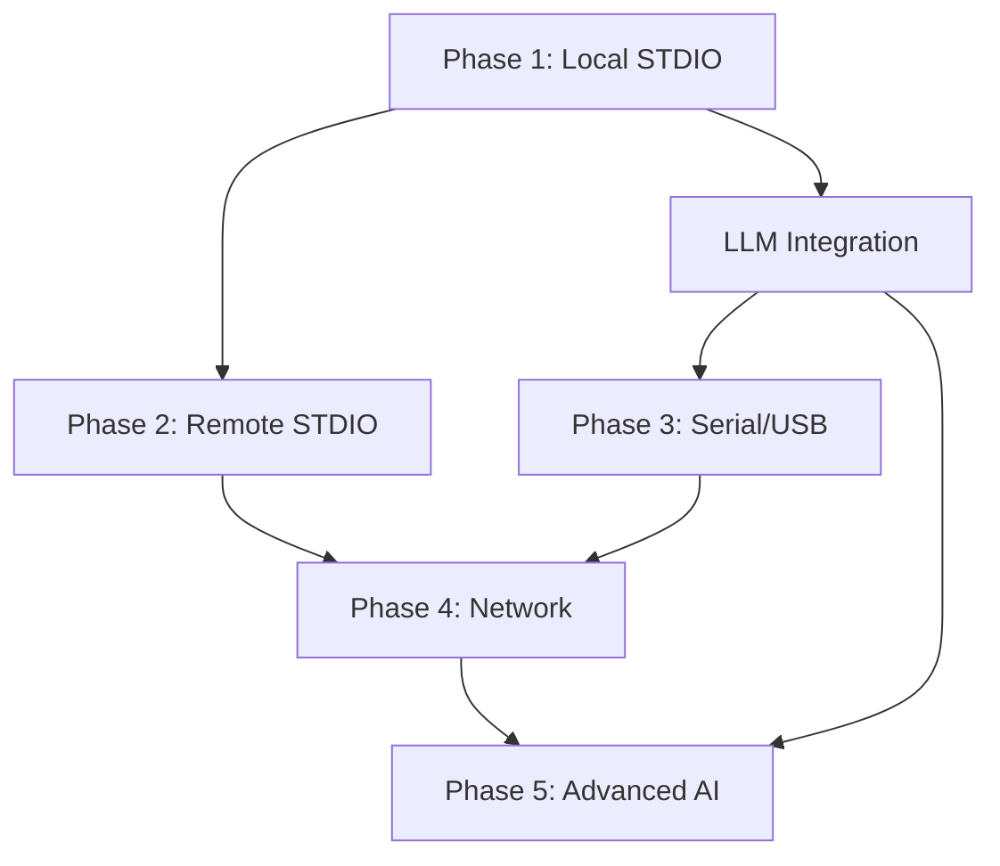

# Stream Infrastructure Implementation Phases

## Executive Summary

This document outlines a pragmatic, phased approach to implementing Strigoi's stream infrastructure. We start with immediate value through local STDIO monitoring while establishing architectural patterns that scale to our full vision.

## Guiding Principles

1. **Deliver Value Early**: Phase 1 must provide immediate threat detection capability
2. **Build for Extension**: Every component should support future stream types
3. **Apply Strategic Patterns**: Use multi-LLM analysis even with single stream type
4. **Maintain Vision**: Don't compromise long-term architecture for short-term gains

## Phase Timeline Overview

```
Phase 1: Local STDIO Foundation (Immediate - 2 weeks)
Phase 2: Remote STDIO via A2A (Month 2)
Phase 3: Serial/USB Monitoring (Month 3)
Phase 4: Network Stream Integration (Month 4-5)
Phase 5: Advanced Intelligence Features (Month 6+)
```

---

## Phase 1: Local STDIO Foundation (Immediate)

### Timeline: 2 weeks

### Core Capabilities
1. **Stream Infrastructure Core**
   - Universal stream abstraction interface
   - Local process monitoring (stdin/stdout/stderr)
   - Stream lifecycle management
   - Basic filtering and routing

2. **Multi-LLM Analysis Pipeline**
   - Claude for pattern detection and ethics
   - Gemini for context analysis (via A2A)
   - Basic consensus mechanism
   - Human-in-the-loop for critical decisions

3. **Edge Intelligence**
   - Pre-processing and sanitization
   - Known pattern filtering
   - Smart buffering for LLM efficiency
   - Resource governors

4. **Basic Response System**
   - Alert generation
   - Stream redirection capability
   - Logging and evidence collection
   - Manual intervention tools

### Strategic Patterns Applied
- **Hierarchical Processing**: Even with one stream type, implement full stack
- **Cybernetic Governors**: Self-regulating stream monitors
- **VSM Architecture**: S1 (capture) → S2 (routing) → S3 (analysis)
- **Learning Loops**: Capture patterns for future improvement

### Implementation Sequence
```go
// Week 1: Core Infrastructure
type Stream interface {
    ID() string
    Type() StreamType
    Subscribe(handler StreamHandler) error
    SetFilter(filter StreamFilter) error
    Start() error
    Stop() error
}

type StreamManager struct {
    streams   map[string]Stream
    router    *StreamRouter
    governors []Governor
}

// Week 2: LLM Integration & Testing
type MultiLLMAnalyzer struct {
    claude   *ClaudeAnalyzer
    gemini   *GeminiA2AClient
    consensus *ConsensusEngine
}
```

### Testing Approach
1. **Unit Tests**: Stream abstraction, filters, governors
2. **Integration Tests**: LLM communication, consensus
3. **Attack Simulations**: Command injection, data exfiltration
4. **Performance Tests**: Stream throughput, LLM latency

### Success Metrics
- ✓ Detect 5 common attack patterns in real-time
- ✓ Process 1000 events/second with <100ms LLM latency
- ✓ Zero false positives on normal developer activity
- ✓ Clean abstraction supporting future stream types

### Dependencies
- Go development environment
- Access to Claude API
- Gemini A2A bridge operational
- Local Linux testing environment

---

## Phase 2: Remote STDIO via A2A (Month 2)

### Core Capabilities
1. **A2A Agent Framework**
   - Secure agent deployment system
   - Cross-platform agents (Linux priority, Windows later)
   - Agent authentication and encryption
   - Health monitoring and auto-recovery

2. **Distributed Stream Management**
   - Remote stream discovery
   - Bandwidth-aware filtering
   - Compressed transport
   - Connection resilience

3. **Enhanced Analysis**
   - Multi-source correlation
   - Distributed attack detection
   - Timeline reconstruction
   - Cross-host pattern matching

### Strategic Patterns Applied
- **Agent Autonomy**: Self-managing remote collectors
- **Federated Architecture**: No single point of failure
- **Adaptive Filtering**: Reduce noise at the edge
- **Secure by Design**: Zero-trust agent communication

### Success Metrics
- ✓ Deploy to 10+ remote hosts reliably
- ✓ Maintain streams over unreliable networks
- ✓ Detect distributed attacks across multiple hosts
- ✓ <1% overhead on monitored systems

### Prerequisites
- Phase 1 complete and stable
- Network security model defined
- Agent signing infrastructure
- Test lab with multiple hosts

---

## Phase 3: Serial/USB Monitoring (Month 3)

### Core Capabilities
1. **Serial Protocol Support**
   - RS-232/485 monitoring
   - USB serial device discovery
   - Protocol detection (Modbus, custom)
   - Baud rate auto-detection

2. **IoT/SCADA Focus**
   - Industrial protocol analysis
   - Anomaly detection for fixed behavior
   - Critical infrastructure protection
   - Physical/cyber correlation

3. **Specialized Analysis**
   - Binary protocol parsing
   - State machine monitoring
   - Timing attack detection
   - Hardware behavior baselines

### Strategic Patterns Applied
- **Domain-Specific Intelligence**: IoT-trained models
- **Real-time Constraints**: Hard timing requirements
- **Safety-Critical Design**: Fail-safe, not fail-deadly
- **Multimodal Analysis**: Combine timing, content, context

### Success Metrics
- ✓ Support 5 common industrial protocols
- ✓ Detect Stuxnet-style attacks
- ✓ <1ms monitoring latency
- ✓ Zero interference with critical systems

---

## Phase 4: Network Stream Integration (Months 4-5)

### Core Capabilities
1. **Protocol Support**
   - HTTP/HTTPS (via MITM proxy)
   - WebSocket streams
   - gRPC monitoring
   - Custom TCP/UDP protocols

2. **Application Layer Intelligence**
   - API behavior analysis
   - Business logic attacks
   - Data exfiltration detection
   - Credential stuffing prevention

3. **Scale Handling**
   - High-volume stream processing
   - Sampling strategies
   - Distributed analysis
   - Cloud-native deployment

### Strategic Patterns Applied
- **Protocol Agnostic Core**: Extensible to new protocols
- **Semantic Analysis**: Understand meaning, not just bytes
- **Privacy-Preserving**: Analyze without storing sensitive data
- **API-First Design**: Enable third-party integrations

### Success Metrics
- ✓ Handle 10Gbps network traffic
- ✓ Support major application protocols
- ✓ Detect OWASP Top 10 in real-time
- ✓ Integrate with existing security tools

---

## Phase 5: Advanced Intelligence Features (Month 6+)

### Core Capabilities
1. **Autonomous Learning**
   - Unsupervised pattern discovery
   - Attack technique extraction
   - Automatic rule generation
   - Model fine-tuning pipeline

2. **Predictive Defense**
   - Attack prediction
   - Vulnerability forecasting
   - Proactive hardening
   - Threat hunting automation

3. **Ecosystem Integration**
   - SIEM/SOAR integration
   - Threat intelligence feeds
   - Compliance automation
   - Security orchestration

### Strategic Patterns Applied
- **Continuous Evolution**: System improves autonomously
- **Collective Intelligence**: Learn from all deployments
- **Anticipatory Security**: Prevent, don't just detect
- **Human Amplification**: Enhance analyst capabilities

---

## Critical Path Dependencies



## Risk Mitigation

### Technical Risks
1. **LLM Latency**: Mitigate with edge filtering and caching
2. **Scale Challenges**: Address early with proper architecture
3. **False Positives**: Implement learning feedback loops
4. **Integration Complexity**: Use clean abstractions

### Operational Risks
1. **Resource Requirements**: Start small, scale gradually
2. **Privacy Concerns**: Build privacy controls from day one
3. **Deployment Complexity**: Automate everything
4. **Skills Gap**: Document thoroughly, train team

## What We Defer (Without Compromising Architecture)

### Defer to Later Phases
1. **GUI/Visualization**: CLI first, GUI later
2. **Windows Support**: Linux first, cross-platform later
3. **Cloud Deployment**: On-premise first, cloud later
4. **Advanced ML**: Rule-based first, ML enhancement later

### Never Compromise
1. **Security**: Every phase must be secure
2. **Architecture**: Clean abstractions from day one
3. **Ethics**: Built into the foundation
4. **Learning**: Capture data for future improvement

## Conclusion

This phased approach allows us to:
- **Deliver immediate value** with local STDIO monitoring
- **Validate core concepts** before scaling
- **Build incrementally** without architectural debt
- **Learn and adapt** based on real usage
- **Maintain momentum** with regular releases

Each phase builds on the previous, creating a compounding effect where the system becomes more capable and intelligent over time. By Month 6, we'll have a comprehensive stream intelligence platform that can adapt to new threats faster than attackers can develop them.

---

*"Start simple, think big, move fast, learn constantly"*