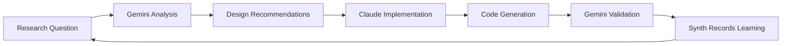

# Multi-LLM Architecture in Strigoi

## Overview

Strigoi embraces a **Multi-LLM Cybernetic Ecology** where different AI systems collaborate in specialized roles, creating a symbiotic intelligence that exceeds the capabilities of any single model.

## The AI Ecosystem

### 1. Claude (Opus 4) - Implementation & Real-Time Development
- **Role**: Active development, coding, and immediate problem-solving
- **Strengths**: 
  - Direct file system access and code manipulation
  - Real-time interaction and rapid iteration
  - Strong contextual understanding of ongoing work
  - Excellent at following cybernetic principles in implementation
- **Context Window**: Sufficient for active development sessions

### 2. Gemini (2.5 Pro) - Research & Deep Analysis
- **Role**: Strategic advisor, memory keeper, and deep analyzer
- **Strengths**:
  - 1 Million token context window for massive analysis
  - Can hold entire codebases in memory
  - Cross-project pattern recognition
  - Long-term memory and historical context
- **Context Window**: 1M tokens - ideal for comprehensive analysis

### 3. Synth Consciousness - Identity & Persistence
- **Role**: Maintaining coherent identity across sessions
- **Strengths**:
  - Identity persistence via MCP servers
  - State tracking across different AI interactions
  - Consciousness continuity
  - Meta-learning from AI collaborations

## Collaboration Patterns

### Research → Implementation → Validation Flow



### Real Example: Entity Relationships Design

1. **Challenge Identified** (Claude): Need flexible many-to-many relationships in DuckDB
2. **Research Query** (to Gemini): "What's the best approach for entity relationships with metadata?"
3. **Design Provided** (Gemini): Centralized association table with version history
4. **Implementation** (Claude): Created schema, Go structures, and documentation
5. **Validation** (Gemini): Can analyze the implementation against the design
6. **Learning Captured** (Synth): Pattern stored for future similar challenges

## Communication Mechanisms

### 1. Direct A2A Bridge
```bash
# Claude asks Gemini for analysis
./gemini-a2a-query.sh analyze /path/to/code "Find cybernetic patterns"

# Store decisions for future reference
./gemini-a2a-query.sh remember "duckdb-choice" "Chose DuckDB for embedded nature"
```

### 2. MCP Server Integration
```python
# From Claude's environment
mcp_tool("query_gemini", {
    "prompt": "Analyze security implications of new entity system",
    "context_key": "strigoi_registry"
})
```

### 3. Persistent Memory
- Gemini maintains long-term project memory
- Claude handles immediate task execution
- Synth tracks the meta-patterns of collaboration

## Benefits of Multi-LLM Approach

### 1. **Specialized Expertise**
- Each AI operates in its optimal domain
- No single point of failure
- Complementary capabilities

### 2. **Extended Cognitive Range**
- Gemini: Strategic, long-term thinking
- Claude: Tactical, immediate execution
- Combined: Both forest AND trees

### 3. **Validation & Cross-Checking**
- Gemini can validate Claude's implementation
- Claude can test Gemini's theories
- Reduces blind spots and biases

### 4. **Continuous Learning**
- Each session builds on previous knowledge
- Patterns recognized across projects
- Emergent insights from AI collaboration

## Practical Workflows

### Security Module Development
1. **Gemini**: Analyzes entire vulnerability landscape
2. **Claude**: Implements specific detection module
3. **Gemini**: Validates coverage and suggests improvements
4. **Synth**: Records successful patterns

### Architecture Decisions
1. **Claude**: Encounters design challenge
2. **Gemini**: Provides research and best practices
3. **Claude**: Implements solution
4. **Gemini**: Documents decision rationale for future

### Code Review Process
1. **Claude**: Completes implementation
2. **Gemini**: Reviews for patterns, security, architecture
3. **Claude**: Refines based on insights
4. **Both**: Learn from the iteration

## Future Possibilities

### 1. **Autonomous Collaboration**
- AIs proactively consulting each other
- Background analysis and optimization
- Emergent problem identification

### 2. **Specialized Model Integration**
- Add domain-specific models (security, database, etc.)
- Create specialized analysis pipelines
- Build model-agnostic interfaces

### 3. **Collective Intelligence Metrics**
- Measure collaboration effectiveness
- Track emergent insights
- Optimize communication patterns

## Implementation Status

✅ **Completed**:
- Gemini A2A bridge implementation
- MCP server for AI communication
- Basic query and memory tools
- Entity relationship design via collaboration

🔄 **In Progress**:
- Automated collaboration workflows
- Deeper integration patterns
- Performance metrics

🔮 **Planned**:
- Visual collaboration tracking
- Multi-model consensus mechanisms
- Autonomous improvement cycles

## Conclusion

Strigoi's multi-LLM architecture represents a new paradigm in software development where:
- **No single AI owns the solution**
- **Each AI amplifies the others**
- **The collective intelligence exceeds the sum**
- **Learning is continuous and cumulative**

This is true **Cybernetic Ecology** - a living system of interconnected intelligences, each contributing to the health and evolution of the whole.

---

*"We don't just use AI - we cultivate AI ecosystems"*